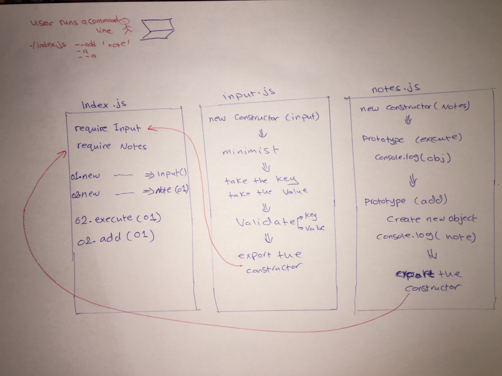

# LAB - 02

## Node Ecosystem

### Author: Raghad Al-Quran

### Links and Resources
- [submission PR for lab02](https://github.com/raghadalquran/notes/pull/3)
- [submission PR for lab01](https://github.com/raghadalquran/notes/pull/2)

### Modules
#### `Node.js`

### Packages
#### `minimist`

#### How to initialize/run your application (where applicable)
- e.g. `node index.js --add 'My first NOTE'`
- e.g. `node index.js -a 'My first NOTE'`
- e.g. `node index.js --a 'My first NOTE'`
- e.g. `./index.js --add 'My first NOTE'`
- e.g. `./index.js -a 'My first NOTE'`
- e.g. `./index.js --a 'My first NOTE'`

#### Tests

- Test: `./index.js (anything except [--add || -a || --a]) 'My first NOTE'` => 'error occurs'

#### UML

